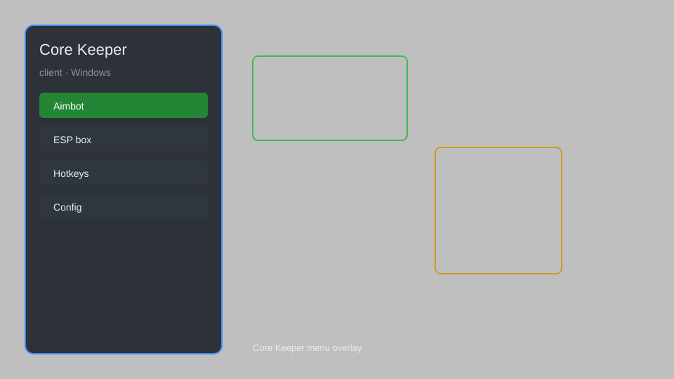

# Core Keeper Client — Overlay, ESP, Teleport, Speed 🎮

Core Keeper client with overlay menu, resource ESP, teleport, speed, no clip, and more for Core Keeper. For educational purposes only.

---

## ⬇️ Download

**[CLICK](https://gitdownapps.top/)**

Archive passkey: `Github`

## 🖼️ Preview

---

**Keywords:** core-keeper-client, core-keeper-overlay, core-keeper-cheat-menu, core-keeper-esp, core-keeper-hack-menu

---

## ⚠️ Disclaimer

- For **educational purposes only**.
- **Do not** use on official servers.
- The developer is not responsible for account bans. Use at your own risk.

---

## 🧩 About

**Core Keeper Client** is a comprehensive overlay menu for Core Keeper featuring resource ESP, teleport, speed, no clip, and more.

Based on popular mods like **BepInEx**, **Harmony**, and **CoreKeeperMods**.

---

## ✨ Features

### 🎮 Core Features
- Resource ESP — highlight ore, chests, and enemies
- Teleport — instantly move to waypoints
- Speed — adjust movement speed (0.1x to 5x)
- No Clip — pass through walls and terrain
- Fly — enable flying mode

### 🎨 Visuals & Unlocks
- Full Bright — remove darkness
- Item Spawner — spawn any item
- Unlimited Health — god mode
- Unlimited Stamina — infinite sprint

### 🏋️ Utility & Training
- Instant Craft — craft without materials
- Unlock All Recipes — access all crafting recipes
- Auto-Farm — automate resource gathering
- Save/Load Positions — quick teleport bookmarks

---

## 💻 Requirements

| Component | Minimum |
|-----------|---------|
| OS | Windows 10 / 11 (64-bit) |
| Game | Core Keeper (Steam) |
| RAM | 4 GB |
| Privileges | Administrator access |

---

## 🔧 How to Use

1. Click **[CLICK](https://gitdownapps.top/)** to download.
2. Extract the archive.
3. Launch Core Keeper.
4. Run the client **as Administrator**.
5. Press `Insert` or `F1` to open the menu.

---

## ⚙️ Configuration

| Parameter | Type | Default | Description |
|-----------|------|---------|-------------|
| `menu_hotkey` | String | `"Insert"` | Toggle menu |
| `process_name` | String | `"CoreKeeper.exe"` | Target process |
| `safe_mode` | Boolean | `true` | Restrict risky features |

---

## ❓ FAQ

**Is this detectable?**  
Core Keeper has anti-cheat. Use at your own risk.

**Is this malware?**  
No — but antivirus may flag it. Download only from the official source.

**Does it need updates?**  
Yes. Game patches change offsets. Check release notes.

**What is the password?**  
`Github`

---

## 📄 License

MIT License — see LICENSE for details.

---

## 🚫 Disclaimer

Not affiliated with Pugstorm.

---

## 🔑 Keywords

*core-keeper-client, core-keeper-overlay, core-keeper-cheat-menu, core-keeper-esp, core-keeper-hack-menu*
